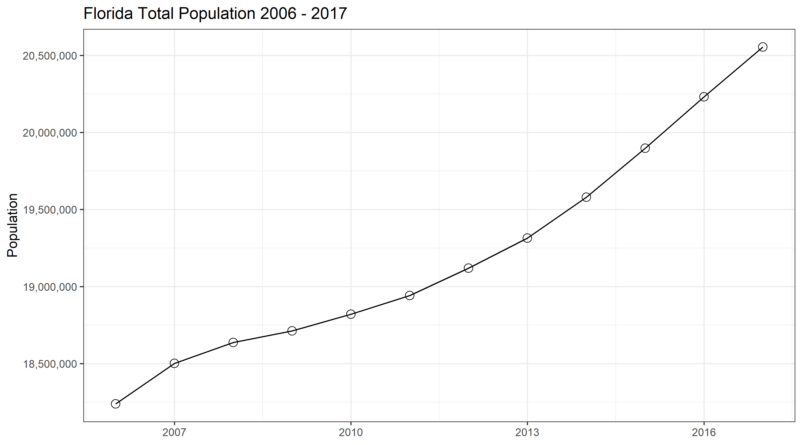
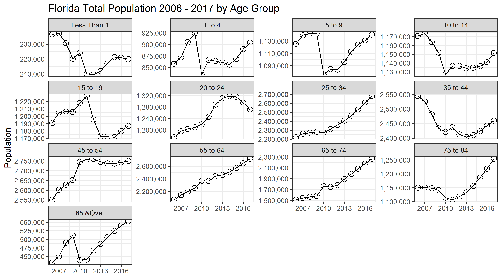
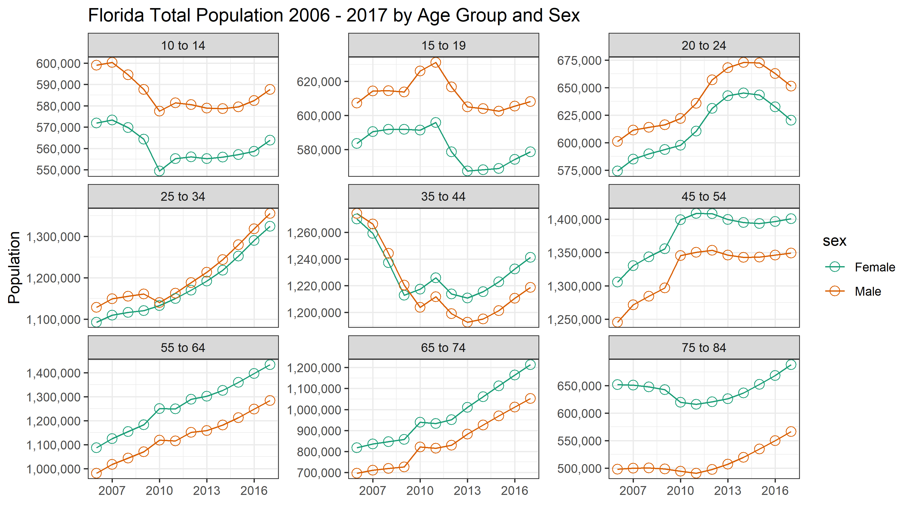
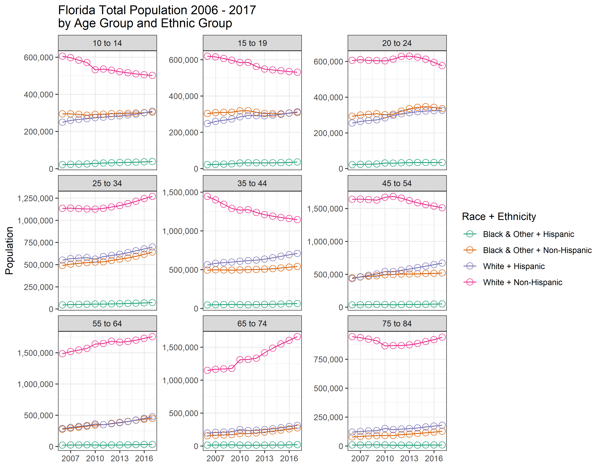
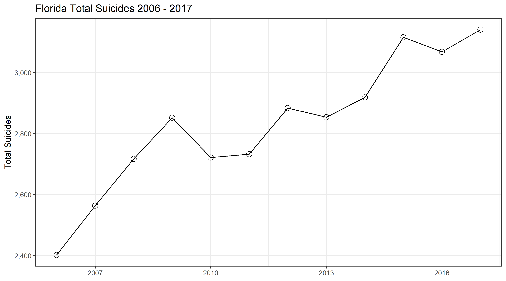
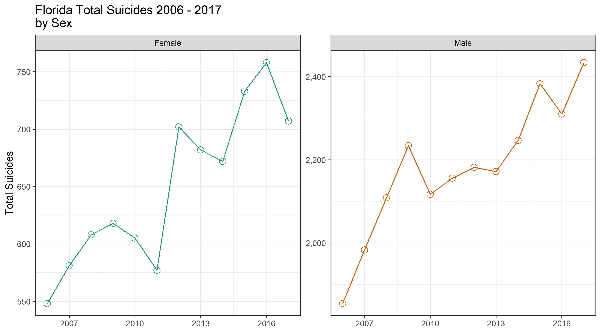
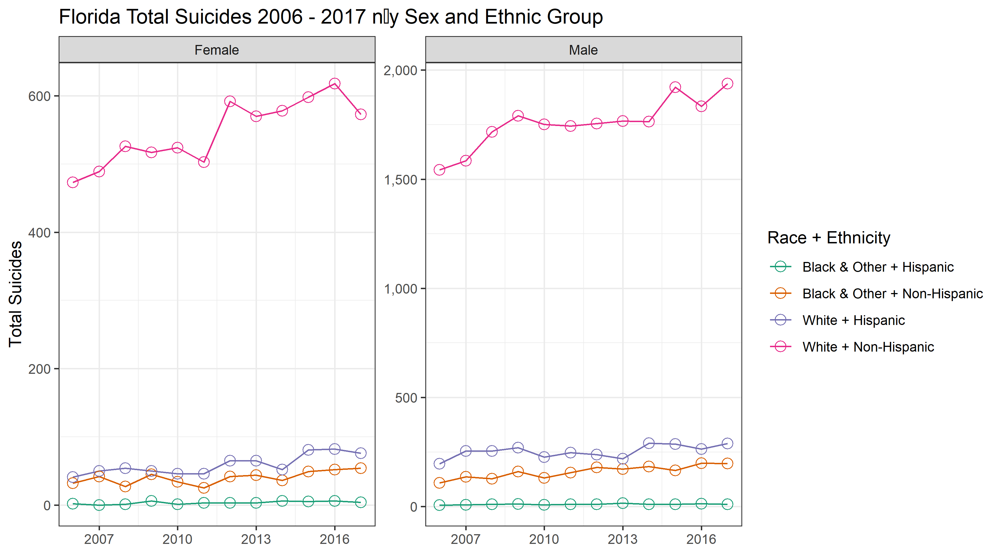
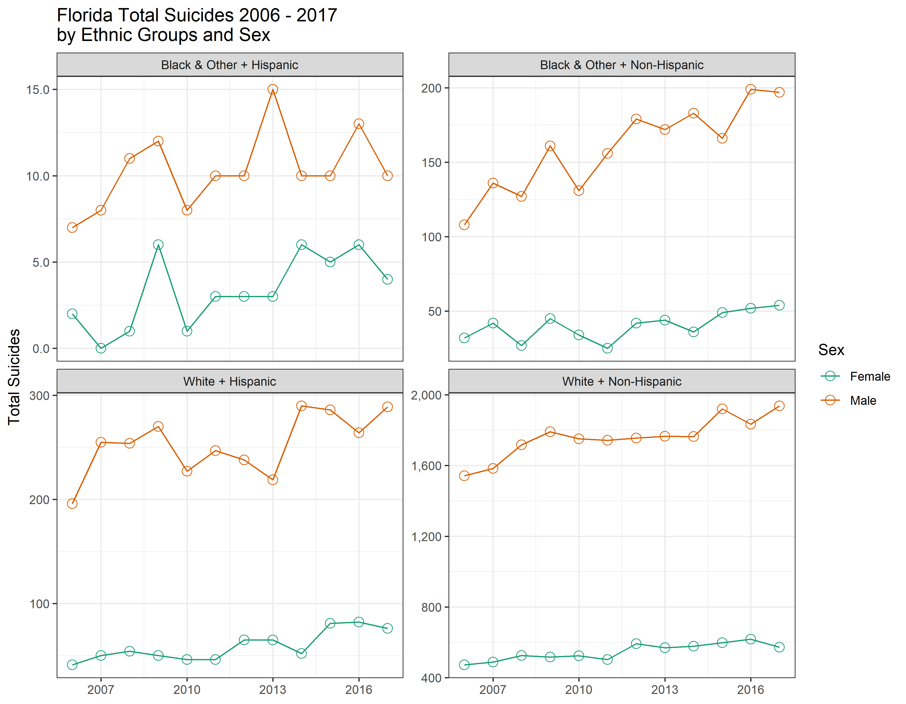
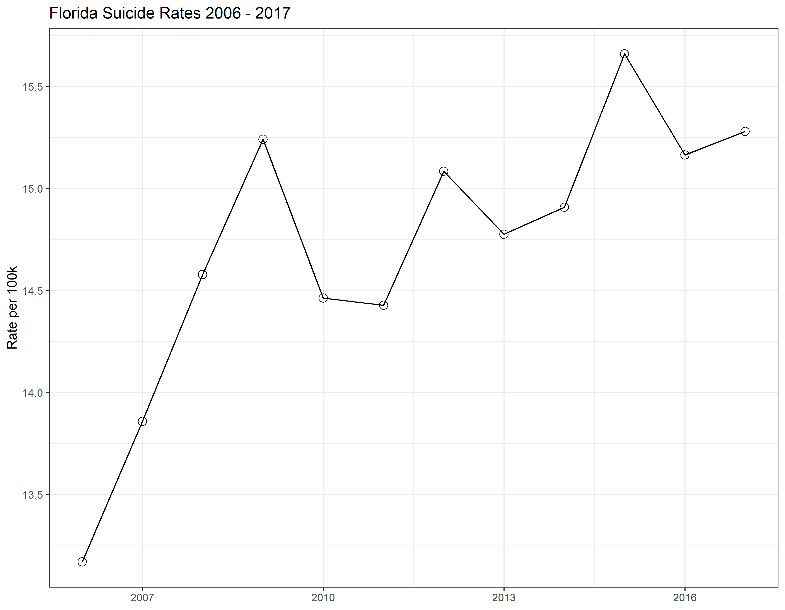
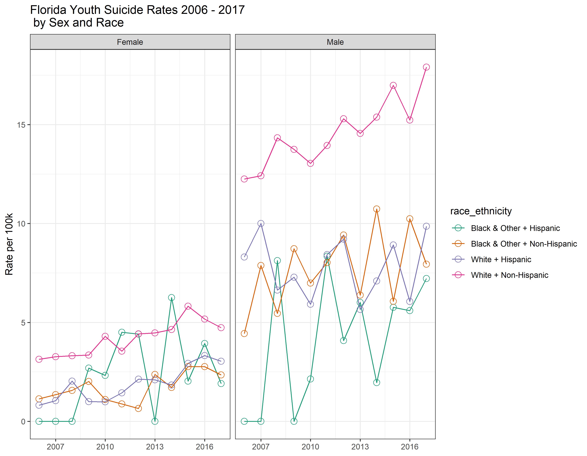

<!-- These two chunks should be added in the beginning of every .Rmd that you want to source an .R script -->
<!--  The 1st mandatory chunck  -->
<!--  Set the working directory to the repository's base directory -->


<!--  The 2nd mandatory chunck  -->
<!-- Set the report-wide options, and point to the external code file. -->


# Environment
<!-- Load packages to be used in the report  --> 

```{.r .numberLines}
# Attach these packages so their functions don't need to be qualified
# see http://r-pkgs.had.co.nz/namespace.html#search-path
library(magrittr) # pipes %>%
library(ggplot2)  # graphs
library(dplyr)    # data wrangling
library(rlang)
requireNamespace("tidyr")  # data tidying
```

<!-- Load 'sourced' R files.  Suppress the output when loading packages. --> 

```{.r .numberLines}
# source("./scripts/modeling/model-basic.R")
# source("./scripts/common-functions.R")
```

<!-- Load any Global functions and variables declared in the R file.  Suppress the output. -->

```{.r .numberLines}
# you will need to replace this path to the location where you stored your data file
path_file_input <- "./data_public/raw/florida-population-suicide.csv"

# to help with sorting the levels of the `age_group` factor
lvl_age_groups <-c(
  "less_than_1"
  ,"1_4"
  ,"5_9"
  ,"10_14"
  ,"15_19"
  ,"20_24"
  ,"25_34"
  ,"35_44"
  ,"45_54"
  ,"55_64"
  ,"65_74"
  ,"75_84"
  ,"85_plus"
)
age_groups_10_84 <- lvl_age_groups[4:12]
age_groups_10_24 <- lvl_age_groups[4:6]

#set global ggplot theme and options
theme_set(theme_bw())
update_geom_defaults("point", list(shape = 1
                                   ,size = 3))

facet_labels <- c(
  "less_than_1" = "Less Than 1"
  ,"1_4"        = "1 to 4"                  
  ,"5_9"        = "5 to 9"                
  ,"10_14"      = "10 to 14"           
  ,"15_19"      = "15 to 19"         
  ,"20_24"      = "20 to 24"           
  ,"25_34"      = "25 to 34"         
  ,"35_44"      = "35 to 44"           
  ,"45_54"      = "45 to 54"         
  ,"55_64"      = "55 to 64"           
  ,"65_74"      = "65 to 74"         
  ,"75_84"      = "75 to 84"           
  ,"85_plus"    = "85 &Over"        
)

make_line_graph <- function(ds,x,y, group = NULL, color = NULL){
  # browser()
  x <- rlang::enquo(x)
  y <- rlang::enquo(y)
  group <- enquo(group)
  color <- enquo(color)
  
  g <- ds %>% 
    ggplot(
      aes(
        x  = !!x
        ,y = !!y
        ,group = !!group
        ,color = !!color
        )
      ) +
    geom_line() +
    geom_point()
  return(g)
}
```


# Data


```{.r .numberLines}
# data from Florida Health Charts
ds_population_suicide <-   readr::read_csv(path_file_input)
```

# Tweaking


```{.r .numberLines}
ds0 <- ds_population_suicide %>%
  dplyr::mutate(
    year            = as.integer(year)
    ,sex            = factor(sex)
    ,race_ethnicity = factor(paste0(race, " + ", ethnicity))
    ,race           = factor(race)
    ,ethnicity      = factor(ethnicity)
    ,age_group      = factor(age_group, levels = lvl_age_groups)
    ,n_population   = as.integer(n_population)
    ,n_suicides     = as.integer(n_suicides)
  )
ds0 %>% dplyr::glimpse(70)
```

```
Observations: 83,616
Variables: 16
$ county                                <chr> "Alachua", "Alachua...
$ year                                  <int> 2006, 2006, 2006, 2...
$ sex                                   <fct> Female, Female, Fem...
$ race                                  <fct> Black & Other, Blac...
$ ethnicity                             <fct> Hispanic, Hispanic,...
$ age_group                             <fct> 1_4, 10_14, 15_19, ...
$ n_population                          <int> 36, 50, 125, 250, 1...
$ n_suicides                            <int> NA, NA, NA, NA, NA,...
$ `Drugs & Biological Substances`       <dbl> NA, NA, NA, NA, NA,...
$ `Other Gases & Vapors`                <dbl> NA, NA, NA, NA, NA,...
$ `Hanging, Strangulation, Suffocation` <dbl> NA, NA, NA, NA, NA,...
$ `Firearms Discharge`                  <dbl> NA, NA, NA, NA, NA,...
$ `Jump From High Place`                <dbl> NA, NA, NA, NA, NA,...
$ `Other & Unspec & Sequelae`           <dbl> NA, NA, NA, NA, NA,...
$ `Other & Unspec Sol/Liq & Vapor`      <dbl> NA, NA, NA, NA, NA,...
$ race_ethnicity                        <fct> Black & Other + His...
```

# Population trends 

## 1. Total count 
> How does the total population of Florida changes between 2006 and 2020?


```{.r .numberLines}
# How did the total population of Florida changed over the years?
g1 <- ds0 %>% 
  group_by(year) %>% 
  summarise(
    n_population = sum(n_population)
  ) %>% 
  make_line_graph(year,n_population) +
  scale_x_continuous(breaks = seq(2007,2020,3)) +
  scale_y_continuous(labels = scales::comma) +
  labs(
    title = "Florida Total Population 2006 - 2017"
    ,x = NULL
    ,y = "Population"
  )
g1
```



The total population of Florida has been steadily growing since the beginning of this data set. 

## 2. Within age groups
> What was the trajectory of population growth for each age group?


```{.r .numberLines}
# What was the trajectory of growth for each age group?

g2 <- ds0 %>% 
  group_by(year,age_group) %>% 
  summarise(
    n_population = sum(n_population)
  ) %>% 
  make_line_graph(year,n_population) +
  scale_x_continuous(breaks = seq(2007,2020,3)) +
  scale_y_continuous(labels = scales::comma) +
  labs(
    title = "Florida Total Population 2006 - 2017 by Age Group"
    ,x    = NULL
    ,y    = "Population"
  ) +
  facet_wrap(
    ~age_group
    ,scales   = "free_y"
    ,labeller = labeller(
      age_group = facet_labels
      )
  )  
g2
```



Populations under 19 have seen a slow rise since around 2011, prior to this there was a sharp decline in the younger ages.  20 to 24 years have in recent years seen a downward trend in total population. Ages 55 and up have been steadly growing since 2010, wereas the 45-54 population saw a marked growth in 2010, and has held steady since.

## 3. Sex and age groups
> For residends between 10 and 84 years of age, what was the trajectory of growth for each age group by sex? 


```{.r .numberLines}
# For residends between 10 and 84 years of age,
# What was the trajectory of growth for each age group by sex?

g3 <- ds0 %>% 
  filter(age_group %in% age_groups_10_84) %>% 
  group_by(year,age_group,sex) %>% 
  summarise(
    n_population = sum(n_population)
  ) %>% 
  make_line_graph(year,n_population, group = sex, color = sex) +
  scale_x_continuous(breaks = seq(2007,2020,3)) +
  scale_y_continuous(labels = scales::comma) +
  scale_color_brewer(palette = "Dark2") +
  labs(
    title = "Florida Total Population 2006 - 2017 by Age Group and Sex"
    ,x    = NULL
    ,y    = "Population"
  ) +
  facet_wrap(
    ~age_group
    ,scales = "free_y"
    ,labeller = labeller(age_group = facet_labels)
  ) 
g3
```


Growth by sex has seen the same paterns explained in the previous graph.  For AGes 34 and under, there are slightly more males then female, where in the older populations there are more females.


## 4. Ethnic group
> For residends between 10 and 84 years of age, what was the trajectory of growth for each ethnic group?


```{.r .numberLines}
# For residends between 10 and 84 years of age,
# What was the trajectory of growth for each ethnic group?
g4 <- ds0 %>% 
  filter(age_group %in% age_groups_10_84) %>% 
  group_by(year,age_group,race_ethnicity) %>% 
  summarise(
    n_population = sum(n_population)
  ) %>% 
  make_line_graph(year,n_population, group = race_ethnicity, color = race_ethnicity) +
  scale_x_continuous(breaks = seq(2007,2020,3)) +
  scale_y_continuous(labels = scales::comma) +
  scale_color_brewer(palette = "Dark2") +
  labs(
    title  = "Florida Total Population 2006 - 2017 \nby Age Group and Ethnic Group"
    ,x     = NULL
    ,y     = "Population"
    ,color = "Race + Ethnicity"
  ) +
  facet_wrap(~age_group
             ,scales = "free_y"
             ,labeller = labeller(age_group = facet_labels)
  ) 
g4
```


The highest growth for these groups is in the White + Non-Hispanic, for all ages older then 24 this group has been growing, with the expect of 35 to 44, this age range has been declining.  For all comboniations of race there has been slight growth arcoss this time period.

# Suicide counts 

## 1. Total count 
> What is the trajectory of total suicides in FL between 2006 and 2017?


```{.r .numberLines}
# What is the trajectory of total suicides in FL between 2006 and 2017?
g5 <- ds0 %>% 
  group_by(year) %>% 
  summarise(
    n_suicides = sum(n_suicides,na.rm = TRUE)
  ) %>% 
  make_line_graph(year,n_suicides) +
  scale_x_continuous(breaks = seq(2007,2020,3)) +
  scale_y_continuous(labels = scales::comma) +
  labs(
    title = "Florida Total Suicides 2006 - 2017"
    ,x    = NULL
    ,y    = "Total Suicides"
  ) +
 scale_color_brewer(palette = "Dark2")
g5
```



Total suicides have been increasing during this time period.  There have been some years of decline but the overall trend has been increasing.

## 2. Men vs Women
> How does the trend of total suicides differ between men and women?


```{.r .numberLines}
# For residends between 10 and 84 years of age,
# How does the trend of total suicides differ between men and women?
g6 <- ds0 %>% 
  group_by(year, sex) %>% 
  summarise(
    n_suicides = sum(n_suicides,na.rm = TRUE)
  ) %>% 
  make_line_graph(year,n_suicides, color = sex) +
  scale_x_continuous(breaks = seq(2007,2020,3)) +
  scale_y_continuous(labels = scales::comma) +
  labs(
    title = "Florida Total Suicides 2006 - 2017 \nby Sex"
    ,x    = NULL
    ,y    = "Total Suicides"
  ) +
  scale_color_brewer(palette = "Dark2") +
  facet_wrap(~sex, scales = "free_y") +
  theme(legend.position = "none")
g6
```



Both sexes have an overall increase in suicides during this time period.  However there are around twice as many more male suicides as there are female suicides.

## 3. Sex and age groups
>For residends between 10 and 84 years of age, how does the trend of suicides counts among ethnic groups differ by sex?  


```{.r .numberLines}
# For residends between 10 and 84 years of age,
# How does the trend of suicides counts among ethnic groups differ by sex

g7 <- ds0 %>% 
  group_by(year, sex, race_ethnicity) %>% 
  summarise(
    n_suicides = sum(n_suicides,na.rm = TRUE)
  ) %>% 
  make_line_graph(year,n_suicides,group = race_ethnicity, color = race_ethnicity) +
  scale_x_continuous(breaks = seq(2007,2020,3)) +
  scale_y_continuous(labels = scales::comma) +
  labs(
    title  = "Florida Total Suicides 2006 - 2017 n\by Sex and Ethnic Group"
    ,x     = NULL
    ,y     = "Total Suicides"
    ,color = "Race + Ethnicity"
  ) +
  scale_color_brewer(palette = "Dark2") +
  facet_wrap(~sex, scales = "free_y") 
g7
```



Based on this data most Florida suicides are recording in the White + Non Hispanic group.  This is true for both male and females, with again males being more likley to commit suicide

## 4. Ethnic group

> For residends between 10 and 84 years of age, how does the trend of total suicides between men and women differ across ethnic groups?  


```{.r .numberLines}
# For residends between 10 and 84 years of age,
# How does the trend of total suicides between men and women differ across ethnic groups?


g8 <- ds0 %>% 
  group_by(year, sex, race_ethnicity) %>% 
  summarise(
    n_suicides = sum(n_suicides,na.rm = TRUE)
  ) %>% 
  make_line_graph(year,n_suicides,group = sex, color = sex) +
  scale_x_continuous(breaks = seq(2007,2020,3)) +
  scale_y_continuous(labels = scales::comma) +
  labs(
    title  = "Florida Total Suicides 2006 - 2017 \nby Ethnic Groups and Sex "
    ,x     = NULL
    ,y     = "Total Suicides"
    ,color = "Sex"
  ) +
  scale_color_brewer(palette = "Dark2") +
  facet_wrap(~race_ethnicity, scales = "free_y") 
g8
```


Based on the data for all ethnic groups female suicide has stayed pretty low, with little to no growth over this time period. On the male side the Latino population has seen a steady rise in suicide cases over this time period

# Suicide rates

## 1. Function `compute_rates`


```{.r .numberLines}
# Compose the function that computes suicide rates per 100,000
compute_suicide_rate <- function(d_input, group_by_variables){
  # d_input <- ds0
  # group_by_variables <- "year"
  d_output <- d_input %>%
    #group the data by user variables
    group_by(., .dots = group_by_variables) %>%
    #summarise based on variables, this allows flexabilty of the totals
    summarise(
      n_population = sum(n_population)
      ,n_suicides  = sum(n_suicides, na.rm = TRUE)
    ) %>% 
    #add the column with rate calculation
  mutate(
    rate_per100k_suicide = (n_suicides/n_population)*100000 
  ) %>% 
    # remove groups
    ungroup()
  return(d_output)
}
```


## 2. Total rates
>  What is the trend of the total suicide rates in Florida between 2006 and 2017?  


```{.r .numberLines}
# What is the trend of the total suicide rates in Florida between 2006 and 2017?
g9 <- ds0 %>%
  compute_suicide_rate("year") %>%
  make_line_graph(year,rate_per100k_suicide) +
  scale_x_continuous(breaks = seq(2007,2020,3)) +
  scale_y_continuous(breaks = seq(13,16,0.5)) +
  labs(
    title = "Florida Suicide Rates 2006 - 2017"
    ,x    = NULL
    ,y    = "Rate per 100k"
  )

g9
```



Suicide rates had sharp growth from 2006 to 2009, then had a decline and have been overall slowly rising back up, ending at the 2009 levels

## 3. Youth by race and gender
> For residends between 10 and 24 years of age, how does the rate of suicide vary by race and gender?  


```{.r .numberLines}
# For residends between 10 and 24 years of age ( as a single group),
# How does the trend of suicide rates among ethnic groups differ by sex?
g10 <- ds0 %>%
  dplyr::filter(age_group %in% age_groups_10_24) %>%
  compute_suicide_rate(c("year","race_ethnicity","sex")) %>%
  make_line_graph(year,rate_per100k_suicide, group = race_ethnicity, color = race_ethnicity) +
  scale_x_continuous(breaks = seq(2007,2020,3)) +
  scale_color_brewer(palette = "Dark2") +
  labs(
    title = "Florida Youth Suicide Rates 2006 - 2017 \n by Sex and Race"
    ,x    = NULL
    ,y    = "Rate per 100k"
  ) +
  facet_wrap(~sex)

g10
```


Youth suicide rates, have had an overall slight growth during the observed time period.  However due to some small populations, the rates are somewhat all over the places, as having a low population even just 1 total event, can spike the rate.

# Further insights

What other interesting patterns did you discern in this data? 


session information
===========================================================================

For the sake of documentation and reproducibility, the current report was rendered in the following environment.  Click the line below to expand.

<details>
  <summary>Environment <span class="glyphicon glyphicon-plus-sign"></span></summary>

```
- Session info -------------------------------------------------------------------------------------------------------
 setting  value                       
 version  R version 3.6.2 (2019-12-12)
 os       Windows 10 x64              
 system   x86_64, mingw32             
 ui       RTerm                       
 language (EN)                        
 collate  English_United States.1252  
 ctype    English_United States.1252  
 tz       America/New_York            
 date     2020-04-15                  

- Packages -----------------------------------------------------------------------------------------------------------
 package      * version date       lib source        
 assertthat     0.2.1   2019-03-21 [1] CRAN (R 3.6.1)
 backports      1.1.5   2019-10-02 [1] CRAN (R 3.6.1)
 callr          3.4.1   2020-01-24 [1] CRAN (R 3.6.2)
 cli            2.0.1   2020-01-08 [1] CRAN (R 3.6.2)
 codetools      0.2-16  2018-12-24 [2] CRAN (R 3.6.2)
 colorspace     1.4-1   2019-03-18 [1] CRAN (R 3.6.1)
 crayon         1.3.4   2017-09-16 [1] CRAN (R 3.6.1)
 desc           1.2.0   2018-05-01 [1] CRAN (R 3.6.2)
 devtools       2.2.1   2019-09-24 [1] CRAN (R 3.6.2)
 digest         0.6.21  2019-09-20 [1] CRAN (R 3.6.1)
 dplyr        * 0.8.3   2019-07-04 [1] CRAN (R 3.6.1)
 ellipsis       0.3.0   2019-09-20 [1] CRAN (R 3.6.1)
 evaluate       0.14    2019-05-28 [1] CRAN (R 3.6.1)
 fansi          0.4.1   2020-01-08 [1] CRAN (R 3.6.2)
 farver         2.0.3   2020-01-16 [1] CRAN (R 3.6.2)
 fs             1.3.1   2019-05-06 [1] CRAN (R 3.6.1)
 ggplot2      * 3.2.1   2019-08-10 [1] CRAN (R 3.6.2)
 glue           1.3.1   2019-03-12 [1] CRAN (R 3.6.1)
 gtable         0.3.0   2019-03-25 [1] CRAN (R 3.6.1)
 hms            0.5.3   2020-01-08 [1] CRAN (R 3.6.2)
 htmltools      0.4.0   2019-10-04 [1] CRAN (R 3.6.1)
 knitr        * 1.28    2020-02-06 [1] CRAN (R 3.6.2)
 labeling       0.3     2014-08-23 [1] CRAN (R 3.6.0)
 lazyeval       0.2.2   2019-03-15 [1] CRAN (R 3.6.1)
 lifecycle      0.1.0   2019-08-01 [1] CRAN (R 3.6.1)
 magrittr     * 1.5     2014-11-22 [1] CRAN (R 3.6.1)
 memoise        1.1.0   2017-04-21 [1] CRAN (R 3.6.2)
 munsell        0.5.0   2018-06-12 [1] CRAN (R 3.6.1)
 pillar         1.4.3   2019-12-20 [1] CRAN (R 3.6.2)
 pkgbuild       1.0.6   2019-10-09 [1] CRAN (R 3.6.2)
 pkgconfig      2.0.3   2019-09-22 [1] CRAN (R 3.6.1)
 pkgload        1.0.2   2018-10-29 [1] CRAN (R 3.6.2)
 prettyunits    1.1.1   2020-01-24 [1] CRAN (R 3.6.2)
 processx       3.4.1   2019-07-18 [1] CRAN (R 3.6.2)
 ps             1.3.0   2018-12-21 [1] CRAN (R 3.6.1)
 purrr          0.3.2   2019-03-15 [1] CRAN (R 3.6.1)
 R6             2.4.1   2019-11-12 [1] CRAN (R 3.6.2)
 RColorBrewer   1.1-2   2014-12-07 [1] CRAN (R 3.6.0)
 Rcpp           1.0.2   2019-07-25 [1] CRAN (R 3.6.1)
 readr          1.3.1   2018-12-21 [1] CRAN (R 3.6.1)
 remotes        2.1.0   2019-06-24 [1] CRAN (R 3.6.2)
 rlang        * 0.4.2   2019-11-23 [1] CRAN (R 3.6.2)
 rmarkdown      2.1     2020-01-20 [1] CRAN (R 3.6.2)
 rprojroot      1.3-2   2018-01-03 [1] CRAN (R 3.6.2)
 scales         1.1.0   2019-11-18 [1] CRAN (R 3.6.2)
 sessioninfo    1.1.1   2018-11-05 [1] CRAN (R 3.6.2)
 stringi        1.4.4   2020-01-09 [1] CRAN (R 3.6.2)
 stringr        1.4.0   2019-02-10 [1] CRAN (R 3.6.1)
 testthat       2.3.1   2019-12-01 [1] CRAN (R 3.6.2)
 tibble         2.1.3   2019-06-06 [1] CRAN (R 3.6.1)
 tidyr          1.0.2   2020-01-24 [1] CRAN (R 3.6.2)
 tidyselect     0.2.5   2018-10-11 [1] CRAN (R 3.6.1)
 usethis        1.5.1   2019-07-04 [1] CRAN (R 3.6.2)
 utf8           1.1.4   2018-05-24 [1] CRAN (R 3.6.1)
 vctrs          0.2.2   2020-01-24 [1] CRAN (R 3.6.2)
 withr          2.1.2   2018-03-15 [1] CRAN (R 3.6.1)
 xfun           0.12    2020-01-13 [1] CRAN (R 3.6.2)
 yaml           2.2.0   2018-07-25 [1] CRAN (R 3.6.0)

[1] C:/Users/belangew/Documents/R/win-library/3.6
[2] C:/Program Files/R/R-3.6.2/library
```
