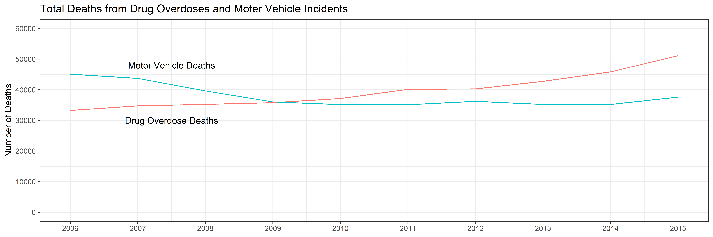
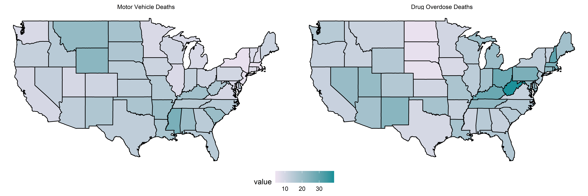

<!-- These two chunks should be added in the beginning of every .Rmd that you want to source an .R script -->
<!--  The 1st mandatory chunck  -->
<!--  Set the working directory to the repository's base directory -->


<!--  The 2nd mandatory chunck  -->
<!-- Set the report-wide options, and point to the external code file. -->


<!-- Load packages to be used in this report. --> 


<!-- Load the sources.  Suppress the output when loading sources. --> 


<!-- Load any Global functions and variables declared in the R file.  Suppress the output. --> 


<!-- Declare any global functions specific to a Rmd output.  Suppress the output. --> 


<!-- Load the datasets.   -->


# Inspect Data

<!-- Inspect the datasets.   -->

```
Observations: 7,840
Variables: 7
$ State                            <chr> "Alabama", "Alabama", "Alabama", "Alabama", "Alabama", "Alabama", "Alabama...
$ `Underlying Cause of Death`      <chr> "Accidental poisoning by and exposure to nonopioid analgesics, antipyretic...
$ `Underlying Cause of Death Code` <chr> "X40", "X41", "X42", "X43", "X44", "X60", "X61", "X62", "X63", "X64", "X85...
$ `Drug Overdose Deaths`           <chr> "Suppressed", "Suppressed", "83", "Suppressed", "216", "Suppressed", "Supp...
$ `Census Region`                  <chr> "South", "South", "South", "South", "South", "South", "South", "South", "S...
$ `Census Division`                <chr> "East South Central", "East South Central", "East South Central", "East So...
$ `Report Date`                    <dttm> 2006-12-31, 2006-12-31, 2006-12-31, 2006-12-31, 2006-12-31, 2006-12-31, 2...
```

```
Observations: 490
Variables: 5
$ `State Name`                    <chr> "Alabama", "Alabama", "Alabama", "Alabama", "Alabama", "Alabama", "Alabama"...
$ `Census Region`                 <chr> "South", "South", "South", "South", "South", "South", "South", "South", "So...
$ `Motor Vehicle Incident Deaths` <dbl> 1224, 1212, 1085, 933, 931, 956, 863, 909, 896, 962, 1323, 1104, 965, 807, ...
$ Date                            <dttm> 2006-12-26, 2007-12-26, 2008-12-26, 2009-12-26, 2010-12-26, 2011-12-26, 20...
$ Population                      <dbl> 4628981, 4672840, 4718206, 4757938, 4779736, 4802740, 4822023, 4833722, 484...
```


<!-- Tweak the datasets.   -->


# Deaths Timeline

<!-- Deaths Timeline   -->

```r
g1 <- ds_combine %>%
  group_by(year) %>% 
  summarise(
    drug_overdose_deaths = sum(drug_overdose_deaths)
    ,motor_vehicle_incident_deaths = sum(motor_vehicle_incident_deaths)
  ) %>% 
  pivot_longer(
    cols  = drug_overdose_deaths:motor_vehicle_incident_deaths
    ,names_to = "death_type"
  ) %>% 
  # save for later, but not needed for this graph
  # mutate(
  #   label  = if_else(year == min(year), as.character(death_type), NA_character_)
  #   ,label = snakecase::to_title_case(label)
  # ) %>% 
  ggplot(aes(x = year, y = value , group = death_type)) +
  geom_line(aes(color = death_type), show.legend = FALSE) +
  # geom_text(aes(label = label), na.rm = TRUE, hjust = -0.1) +  
  # ggrepel::geom_text_repel(aes(label = label), na.rm = TRUE) +
  annotate("text", x = 2007.5, y = 30000, label = "Drug Overdose Deaths") +
  annotate("text", x = 2007.5, y = 48000, label =  "Motor Vehicle Deaths") +
  scale_x_continuous(breaks = seq(2006,2015,1)) +
  scale_y_continuous(breaks = seq(0,60000,10000), limits = c(0,60000)) +
  labs(
    title = "Total Deaths from Drug Overdoses and Moter Vehicle Incidents"
    ,x    = NULL
    ,y    = "Number of Deaths"
  )
g1
```



# 2015 Death Rates

<!-- 2015 Death Rates   -->

```r
states_map <- map_data("state")

deaths_map <- ds_combine %>% 
  filter(year == 2015) %>% 
  mutate(state = tolower(state)) %>% 
  select(state,drug_overdose_death_rate, motor_death_rate) %>% 
  merge(states_map, by.x = "state", by.y = "region")

#testing maps

# g2 <- deaths_map %>% 
#   ggplot(aes(x = long, y = lat, group = group, fill = drug_overdose_death_rate)) +
#   geom_polygon(colour = "black") +
#   coord_map() +
#   theme(legend.position = "bottom")
# g2


deaths_map_long <- deaths_map %>% 
  pivot_longer(
    drug_overdose_death_rate:motor_death_rate
    ,names_to = "death_type"
  ) %>% 
  mutate(
    death_type = factor(
      death_type
      ,levels = c("motor_death_rate","drug_overdose_death_rate" )
      ,labels = c("Motor Vehicle Deaths", "Drug Overdose Deaths")
      )
    )
  
g3 <- deaths_map_long %>% 
  ggplot(aes(x = long, y = lat, group = group, fill = value)) +
  geom_polygon(colour = "black") +
  coord_map() +
  theme(legend.position = "bottom") +
  scale_fill_gradient(
    low   = "#ece2f0"
    ,high = "#1c9099"
  ) +
  facet_wrap(~death_type)
g3
```



Session information
===========================================================================

For the sake of documentation and reproducibility, the current report was rendered in the following environment.  Click the line below to expand.

<details>
  <summary>Environment <span class="glyphicon glyphicon-plus-sign"></span></summary>

```
- Session info -------------------------------------------------------------------------------------------------------
 setting  value                       
 version  R version 3.6.2 (2019-12-12)
 os       Windows 10 x64              
 system   x86_64, mingw32             
 ui       RTerm                       
 language (EN)                        
 collate  English_United States.1252  
 ctype    English_United States.1252  
 tz       America/New_York            
 date     2020-03-25                  

- Packages -----------------------------------------------------------------------------------------------------------
 package     * version date       lib source        
 assertthat    0.2.1   2019-03-21 [1] CRAN (R 3.6.1)
 backports     1.1.5   2019-10-02 [1] CRAN (R 3.6.1)
 callr         3.4.1   2020-01-24 [1] CRAN (R 3.6.2)
 cellranger    1.1.0   2016-07-27 [1] CRAN (R 3.6.1)
 cli           2.0.1   2020-01-08 [1] CRAN (R 3.6.2)
 colorspace    1.4-1   2019-03-18 [1] CRAN (R 3.6.1)
 crayon        1.3.4   2017-09-16 [1] CRAN (R 3.6.1)
 desc          1.2.0   2018-05-01 [1] CRAN (R 3.6.2)
 devtools      2.2.1   2019-09-24 [1] CRAN (R 3.6.2)
 digest        0.6.21  2019-09-20 [1] CRAN (R 3.6.1)
 dplyr       * 0.8.3   2019-07-04 [1] CRAN (R 3.6.1)
 ellipsis      0.3.0   2019-09-20 [1] CRAN (R 3.6.1)
 evaluate      0.14    2019-05-28 [1] CRAN (R 3.6.1)
 fansi         0.4.1   2020-01-08 [1] CRAN (R 3.6.2)
 farver        2.0.3   2020-01-16 [1] CRAN (R 3.6.2)
 fs            1.3.1   2019-05-06 [1] CRAN (R 3.6.1)
 ggplot2     * 3.2.1   2019-08-10 [1] CRAN (R 3.6.2)
 glue          1.3.1   2019-03-12 [1] CRAN (R 3.6.1)
 gtable        0.3.0   2019-03-25 [1] CRAN (R 3.6.1)
 htmltools     0.4.0   2019-10-04 [1] CRAN (R 3.6.1)
 knitr       * 1.28    2020-02-06 [1] CRAN (R 3.6.2)
 labeling      0.3     2014-08-23 [1] CRAN (R 3.6.0)
 lazyeval      0.2.2   2019-03-15 [1] CRAN (R 3.6.1)
 lifecycle     0.1.0   2019-08-01 [1] CRAN (R 3.6.1)
 lubridate     1.7.4   2018-04-11 [1] CRAN (R 3.6.1)
 magrittr    * 1.5     2014-11-22 [1] CRAN (R 3.6.1)
 mapproj       1.2.7   2020-02-03 [1] CRAN (R 3.6.3)
 maps        * 3.3.0   2018-04-03 [1] CRAN (R 3.6.2)
 memoise       1.1.0   2017-04-21 [1] CRAN (R 3.6.2)
 munsell       0.5.0   2018-06-12 [1] CRAN (R 3.6.1)
 pillar        1.4.3   2019-12-20 [1] CRAN (R 3.6.2)
 pkgbuild      1.0.6   2019-10-09 [1] CRAN (R 3.6.2)
 pkgconfig     2.0.3   2019-09-22 [1] CRAN (R 3.6.1)
 pkgload       1.0.2   2018-10-29 [1] CRAN (R 3.6.2)
 prettyunits   1.1.1   2020-01-24 [1] CRAN (R 3.6.2)
 processx      3.4.1   2019-07-18 [1] CRAN (R 3.6.2)
 ps            1.3.0   2018-12-21 [1] CRAN (R 3.6.1)
 purrr         0.3.2   2019-03-15 [1] CRAN (R 3.6.1)
 R6            2.4.1   2019-11-12 [1] CRAN (R 3.6.2)
 Rcpp          1.0.2   2019-07-25 [1] CRAN (R 3.6.1)
 readxl        1.3.1   2019-03-13 [1] CRAN (R 3.6.1)
 remotes       2.1.0   2019-06-24 [1] CRAN (R 3.6.2)
 rlang         0.4.2   2019-11-23 [1] CRAN (R 3.6.2)
 rmarkdown     2.1     2020-01-20 [1] CRAN (R 3.6.2)
 rprojroot     1.3-2   2018-01-03 [1] CRAN (R 3.6.2)
 scales        1.1.0   2019-11-18 [1] CRAN (R 3.6.2)
 sessioninfo   1.1.1   2018-11-05 [1] CRAN (R 3.6.2)
 stringi       1.4.4   2020-01-09 [1] CRAN (R 3.6.2)
 stringr     * 1.4.0   2019-02-10 [1] CRAN (R 3.6.1)
 testthat      2.3.1   2019-12-01 [1] CRAN (R 3.6.2)
 tibble        2.1.3   2019-06-06 [1] CRAN (R 3.6.1)
 tidyr       * 1.0.2   2020-01-24 [1] CRAN (R 3.6.2)
 tidyselect    0.2.5   2018-10-11 [1] CRAN (R 3.6.1)
 usethis       1.5.1   2019-07-04 [1] CRAN (R 3.6.2)
 utf8          1.1.4   2018-05-24 [1] CRAN (R 3.6.1)
 vctrs         0.2.2   2020-01-24 [1] CRAN (R 3.6.2)
 withr         2.1.2   2018-03-15 [1] CRAN (R 3.6.1)
 xfun          0.12    2020-01-13 [1] CRAN (R 3.6.2)
 yaml          2.2.0   2018-07-25 [1] CRAN (R 3.6.0)

[1] C:/Users/belangew/Documents/R/win-library/3.6
[2] C:/Program Files/R/R-3.6.2/library
```
